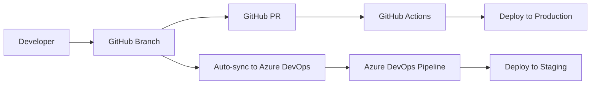
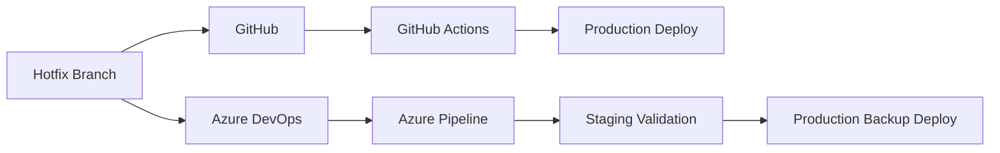

# Repository Synchronization Strategy
## GitHub ↔ Azure DevOps Dual CI/CD Setup for EduCMS

### 🎯 Executive Summary

This document outlines the strategy for maintaining synchronized repositories between GitHub and Azure DevOps while operating dual CI/CD pipelines for the EduCMS project. This approach demonstrates enterprise-level DevOps proficiency and provides redundancy for deployment processes.

---

## 📊 Current State Analysis

### GitHub Repository
- **URL**: https://github.com/franklinmarceloferrer-cmd/educsme
- **Status**: ✅ Active with complete codebase
- **CI/CD**: ✅ GitHub Actions workflow deployed to Azure Web App
- **Deployment**: ✅ https://educsme.azurewebsites.net

### Azure DevOps Repository
- **URL**: https://franklinmarceloferrer@dev.azure.com/franklinmarceloferrer/educsme/_git/educsme
- **Status**: ❌ Empty repository
- **CI/CD**: ❌ Not configured
- **Deployment**: ❌ Not set up

---

## 🚀 Synchronization Strategy

### Recommended Approach: Bidirectional Sync with Primary/Secondary Model

**Primary Repository**: GitHub (for open-source visibility and community)
**Secondary Repository**: Azure DevOps (for enterprise features and redundancy)

### Benefits of This Approach

✅ **Redundancy**: Multiple deployment pipelines ensure high availability
✅ **Skill Demonstration**: Shows proficiency with both platforms
✅ **Enterprise Features**: Access to Azure DevOps advanced features
✅ **Open Source**: Maintains GitHub visibility for portfolio
✅ **Flexibility**: Can switch primary platforms if needed

---

## 📋 Implementation Plan

### Phase 1: Initial Repository Sync

#### Step 1: Clone and Push to Azure DevOps

```bash
# Navigate to your local repository
cd C:\Users\frank_o3qkvjc\Documents\GitHub\educsme

# Verify current remotes
git remote -v

# Add Azure DevOps as a remote
git remote add azure https://franklinmarceloferrer@dev.azure.com/franklinmarceloferrer/educsme/_git/educsme

# Push all branches to Azure DevOps
git push azure main
git push azure develop

# Push all tags
git push azure --tags

# Verify sync
git remote -v
```

#### Step 2: Verify Repository Contents

```bash
# Check that all files are present in Azure DevOps
git ls-remote azure
```

### Phase 2: Set Up Automated Synchronization

#### Option A: GitHub Actions Mirror (Recommended)

Create `.github/workflows/mirror-to-azure-devops.yml` (file will be created separately)

#### Option B: Azure DevOps Build Trigger

Create a pipeline in Azure DevOps that pulls from GitHub on schedule:

```yaml
# azure-pipelines-sync.yml
trigger: none

schedules:
- cron: "0 */6 * * *"  # Every 6 hours
  displayName: Sync from GitHub
  branches:
    include:
    - main
    - develop

pool:
  vmImage: 'ubuntu-latest'

steps:
- checkout: none

- script: |
    git clone https://github.com/franklinmarceloferrer-cmd/educsme.git temp-repo
    cd temp-repo
    git remote add azure $(System.AccessToken)@dev.azure.com/franklinmarceloferrer/educsme/_git/educsme
    git push azure --all
    git push azure --tags
  displayName: 'Sync from GitHub'
```

### Phase 3: Configure Dual CI/CD Pipelines

#### Pipeline Coordination Strategy

**GitHub Actions** (Primary):
- Triggers on: Push to `main`, `develop`
- Deploys to: Production Azure Web App
- Notifications: Slack/Teams integration

**Azure DevOps** (Secondary):
- Triggers on: Manual, Scheduled, or GitHub webhook
- Deploys to: Staging/Testing environments
- Advanced features: Approvals, gates, variable groups

---

## 🔄 Synchronization Workflows

### Workflow 1: Development Flow



### Workflow 2: Hotfix Flow



---

## 🛠️ Configuration Files

### Required Files for Dual Setup

1. **GitHub Actions**: `.github/workflows/azure-deploy.yml` ✅ (existing)
2. **Azure DevOps Frontend**: `azure-pipelines.yml` ✅ (created)
3. **Azure DevOps Backend**: `azure-pipelines-backend.yml` ✅ (created)
4. **Mirror Workflow**: `.github/workflows/mirror-to-azure-devops.yml` (to be created)

### Environment Variables Mapping

| GitHub Secrets | Azure DevOps Variable Groups |
|----------------|------------------------------|
| `VITE_SUPABASE_URL` | `EduCMS-Secrets.VITE_SUPABASE_URL` |
| `VITE_SUPABASE_ANON_KEY` | `EduCMS-Secrets.VITE_SUPABASE_ANON_KEY` |
| `AZURE_WEBAPP_PUBLISH_PROFILE` | Service Connection |
| `AZURE_DEVOPS_PAT` | Not needed in Azure DevOps |

---

## 🔐 Security Considerations

### Access Control

**GitHub**:
- Branch protection rules on `main` and `develop`
- Required PR reviews
- Status checks must pass

**Azure DevOps**:
- Environment approvals for production
- Variable group permissions
- Service connection security

### Secrets Management

**GitHub Secrets** (Repository Settings → Secrets):
```
AZURE_DEVOPS_PAT: Personal Access Token for Azure DevOps
VITE_SUPABASE_URL: Supabase project URL
VITE_SUPABASE_ANON_KEY: Supabase anonymous key
AZURE_WEBAPP_PUBLISH_PROFILE: Azure Web App publish profile
```

**Azure DevOps Variable Groups**:
- Secure variables marked as secret
- Scoped to specific pipelines
- Environment-specific configurations

---

## 📊 Monitoring and Maintenance

### Health Checks

**Daily**:
- [ ] Verify repository sync status
- [ ] Check pipeline success rates
- [ ] Monitor deployment health

**Weekly**:
- [ ] Review failed synchronizations
- [ ] Update dependencies in both platforms
- [ ] Verify backup deployment capabilities

**Monthly**:
- [ ] Audit access permissions
- [ ] Review and update documentation
- [ ] Test disaster recovery procedures

### Troubleshooting Common Issues

**Sync Failures**:
1. Check PAT expiration
2. Verify network connectivity
3. Review branch protection conflicts

**Pipeline Conflicts**:
1. Ensure different deployment slots
2. Coordinate deployment timing
3. Use feature flags for conflicting changes

---

## 🎯 Success Metrics

### Key Performance Indicators

- **Sync Success Rate**: >99%
- **Deployment Success Rate**: >95%
- **Mean Time to Recovery**: <15 minutes
- **Pipeline Execution Time**: <10 minutes

### Monitoring Tools

- Azure DevOps Analytics
- GitHub Actions insights
- Azure Application Insights
- Custom monitoring dashboards

---

## 📞 Next Steps

1. **Immediate** (Today):
   - [ ] Execute Phase 1: Initial sync
   - [ ] Test Azure DevOps pipeline creation

2. **Short-term** (This Week):
   - [ ] Set up automated mirroring
   - [ ] Configure variable groups
   - [ ] Test dual deployments

3. **Long-term** (Next Month):
   - [ ] Implement monitoring
   - [ ] Document operational procedures
   - [ ] Train team on dual-platform workflow

---

## 📚 Additional Resources

- [Azure DevOps Git Documentation](https://docs.microsoft.com/en-us/azure/devops/repos/git/)
- [GitHub Actions Documentation](https://docs.github.com/en/actions)
- [Multi-Repository Strategies](https://docs.microsoft.com/en-us/azure/devops/pipelines/repos/multi-repo-checkout)
